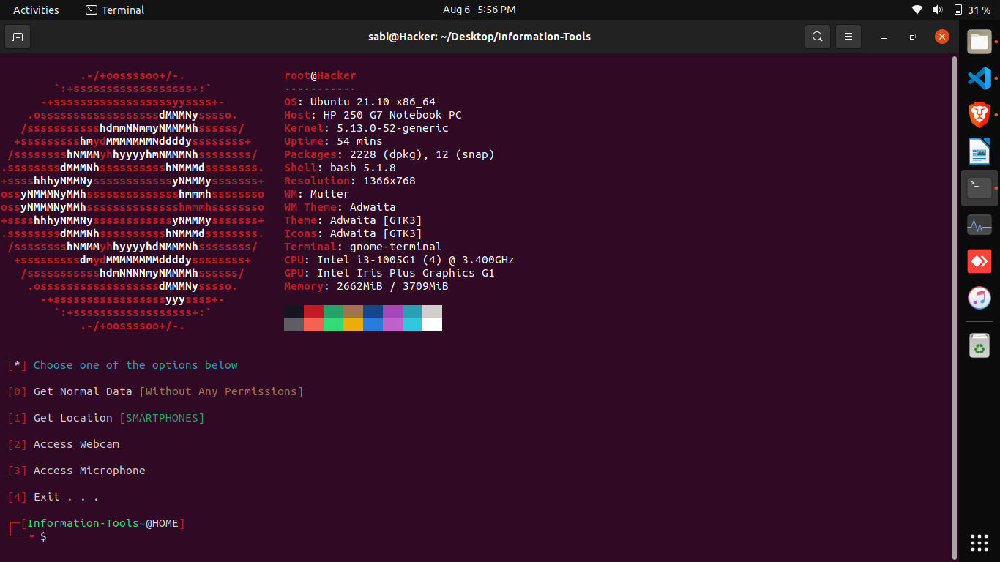

<h1 align="center">
  <br>
  <a href="https://github.com/SapreetGujjar/Information-Tools.git"></a>

</h1>

<h4 align="center">A tool with attractive capabilities</h4>

<p align="center">
  <a href="http://python.org">
    
  </a>
  <a href="https://php.net">
    
  </a>

  <a href="https://www.microsoft.com/de-de/">
    
  </a>
</p>



### Features:

- Get Device Information Without Any Permissions
- Access Location [SMARTPHONES]
- Access Webcam
- Access Microphone


### Update Log:

- The overall structure of the tool is programmed from scratch
- Previous versions bugs fixed
- Added auto-download ngrok

> We have deleted ngrok in the new version of Information Tools and entrusted the user with run and share the localhost. So please note that Information Tools runs a localhost for you and you have to start the ngrok on your intended port yourself.


### Dependencies

**`Information-Tools`** requires following programs to run properly - 
- `php`
- `neofetch`
- `python3`
- `git`
- `ngrok`

### Operating Systems Tested

- Kali Linux 2022
- Ubuntu 21.10

### Installation On Kali Linux


```bash
$ git clone https://github.com/SapreetGujjar/Information-Tools.git
$ cd Information-Tools
$ sudo bash install.sh
$ sudo python3 -m pip install -r requirements.txt
$ sudo python3 sabi.py
```


 
</p>
